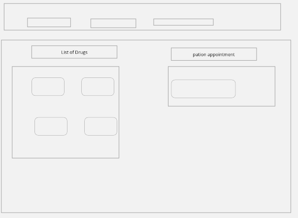
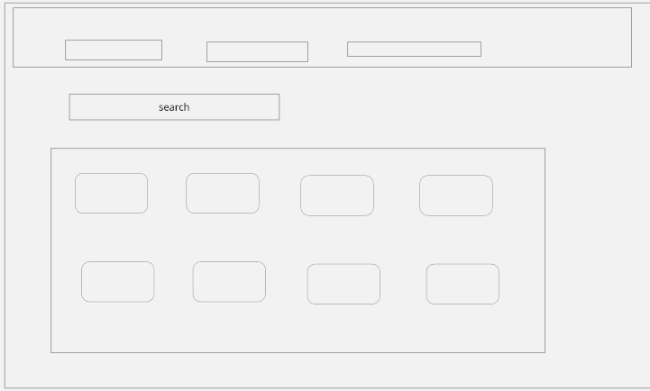

# baymax

> ## Team Members:

1. Yousef Salem.
2. Aseel Farrar
3. Ahmad Ali.
4. Muhammed Jaradat.
5. Judy Bataineh.

> ## Description for Hospital Management System:

The Hospital management system provides a well-tuned management system that helps to automate the workflow and activities of a hospital. This system manages the administrative and financial activities of the hospital along with all the medical facilities. There are four users in this system- Admin, Doctor, Patient, and the Receptionist. Admin can manage all the other users of the system and maintains the database of the system. Whole system supports the vital activities of daily tasks and interactions smoothly.

> ## Project Wireframes

* _**Home Page**_

  

* _**Signup Page**_

  

* _**Login Page**_

  

* _**Appointment Page**_

  

* _**Patient record Page**_

  

* _**Pharmacy Page**_

  

* _**Review Page**_

  
